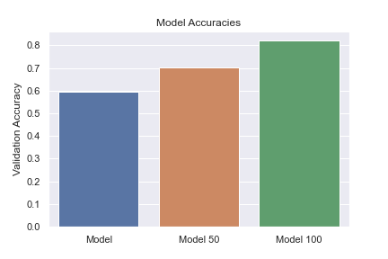
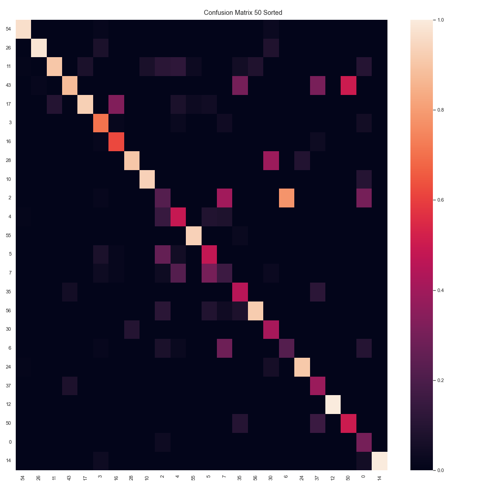
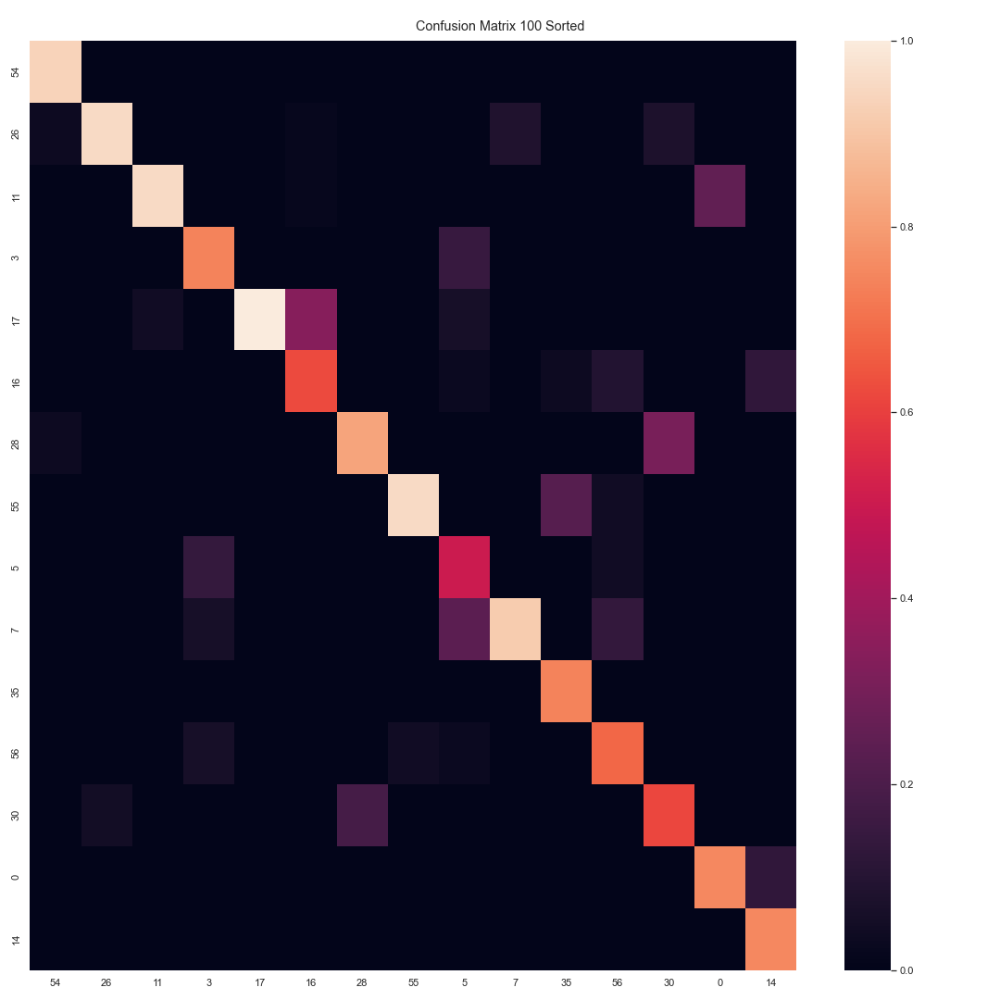

# Classifying Traffic Signs using a CNN

## Data
The data was acquired from:
  http://www.nlpr.ia.ac.cn/pal/trafficdata/recognition.html

Because the dataset is too big, it is not included in the repository. However, it can be accessed from:
  https://drive.google.com/drive/folders/1C_sF_xbBoqOxBxpqbt7BSQQU_GLUvFZy?usp=sharing
  
  
  _To replicate the code, the data set should be placed in a folder "data" in the working directory_
  
## Project Details
This project was developed in partial fulfillment of a data science bootcamp offered by CodingDojo.com. Initially, the goal of the project was to classify the unique traffic signs in the data set using a CNN. However, after some initial EDA, it was found that the dataset is very imbalanced with most classes lying under the 50 sample size threshold as can be seen below:

From then on, the project quickly transitioned from a simple classification problem to a learning experience trying to understand how well a CNN could fit on certain thresholds.

To do this, two additional datasets were derived from the original with 50 and 100 class sample size thresholds respectively. As is expected, the model performs better on data sets with greater sample sizes:

However, to understand the model's performance better, it is necessary to look into how the model's performance on individual classes. The following three charts shows individual class performance based on each of the three datasets:

_*Class sample size is descending from left to right and from top to bottom._

_*The outliers at the bottom right of the graph can be disregarded because the sample size for those classes are too small. Some with no more than 5._

Notice how, as sample size decreases, model performance decreases. However, there are some outliers in the central area of the heatmap. Looking at the heatmap for the 100 threshold dataset, classes 5 and 7, classes 16 and 17, and classes 28 and 30 stand out as classes which the model frequently misclassifies as either class in the pair. Looking at what images these classes are exactly, this was found:

Knowing this, it can be concluded that, while the model has good accuracy scores in general, it's still lacking in its capability to correctly classify and distinguish between two similar looking classes. Further work into specifically addressing this issue is outside of the score of this small project, however, below are some proposals for future research:

    1. Explore the model performance with more complext CNNs.
    2. Attain a more complete traffic sign data set and compare model performance.
    3. Use ensemble models in which one model could group classes and feed those models that specialize in those specific class groups.
    4. Explore the possibility of feature engineering, such as alpha versions of the same images.
